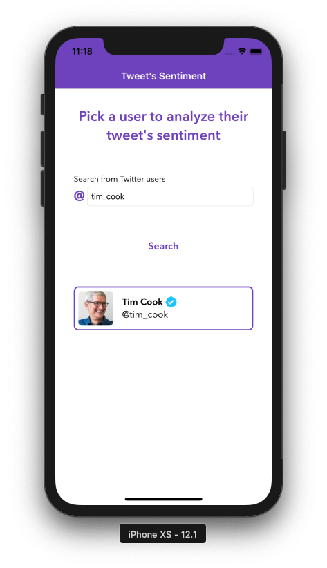
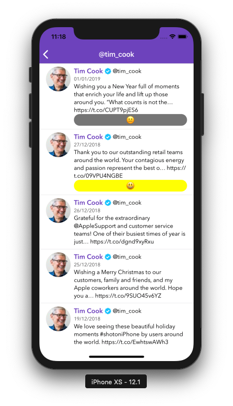

# Tweet Sentiment
This is a native iOS app developed with Swift 4.2 that uses data from Twitter and the help from Google's Natural Language API to retrieve users and their tweets and then analyze them.

## Screenshots


## Features
+ Search for a Twitter user
+ See a list of tweets from that user
+ Select a tweet to analyze it and have it classified as either Happy, Sad or Neutral

## Architecture
The project is organized with Clean Architecture and MVP for the presentation layer.

## Note
App uses CocoaPods, though the `Pods` folder is checked in the repository.

use `pod install` only if necessary.

## Case
````
# ifood-mobile-test
Create an app that given an Twitter username it will list user's tweets. When I tap one of the tweets the app will visualy indicate if it's a happy, neutral or sad tweet.

## Business rules
* Happy Tweet: We want a vibrant yellow color on screen with a 😃 emoji
* Neutral Tweet: We want a grey colour on screen with a 😐 emoji
* Sad Tweet: We want a blue color on screen with a 😔 emoji
* For the first release we will only support english language

### Hints
* You may use Twitter's oficial API (https://developer.twitter.com) to fetch user's tweets 
* Google's Natural Language API (https://cloud.google.com/natural-language/) may help you with sentimental analysis.

## Non functional requirements
* As this app will be a worldwide success, it must be prepared to be fault tolerant, responsive and resilient.
* Use whatever language, tools and frameworks you feel comfortable to.
* Briefly elaborate on your solution, architecture details, choice of patterns and frameworks.
* Fork this repository and submit your code.
````
